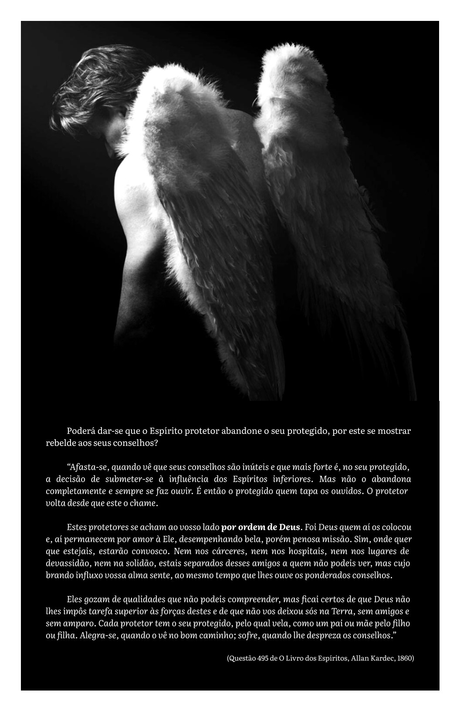
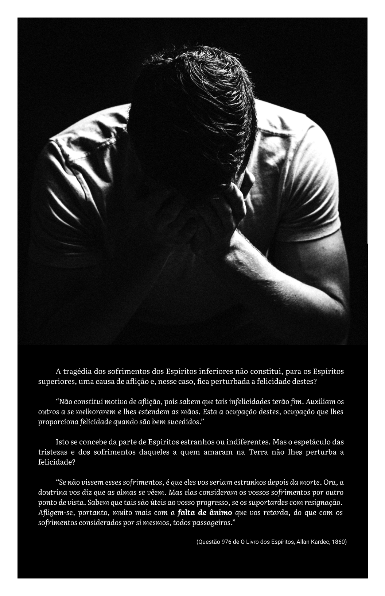

*[LDE]: O Livro dos Espíritos
*[LDM]: O Livro dos Médiuns
*[ESE]: O Evangelho segundo o Espiritismo
*[CEU]: O Céu e o Inferno
*[GEN]: A Gênese

# Educação Moral e Ética

Estando juntos desde 2010, todo dia tentamos nos aperfeiçoar, na moralidade e intelectualidade. Frequentemente falhamos, com nós mesmos, um com o outro, com nossos amigos, e com nossas famílias.  

Entretanto, tentamos aprender com nossos erros e seguimos em frente, aconselhados por nossos mentores e confiantes no amor e misericórdia de Deus.  

Por favor, use e compartilhe de nossos projetos educacionais com outros que pensam de maneira similar.  

Deus sempre lhe abençoa.  

Mai & Sergio
{:class="cursive"}

## Projetos

### 💧 doutrina.org

Inspirado em outras iniciativas de ensino digital, tais como Kardecpedia e Portal Luz Espírita, decidimos criar uma alternativa que permitisse ao estudante a consulta direta de fontes complementares sem que seu foco se perdesse ao navegar em janelas externas.  

### 5️⃣ Cinco

Ler todas as obras básicas da doutrina Espírita em apenas 1 ano?  

Você pode escolher uma das três opções abaixo para ser notificado diariamente: 
assinar a este calendário público pelo Google Calendar (comece em 1º de Janeiro)
vir diretamente nesta página e utilizar o calendário embutido (comece em 1º de Janeiro)
assinar esta lista para receber emails diários (comece a qualquer dia do ano)
A cada dia do ano lhe apresentaremos um PDF de 5 páginas para sua leitura diária (10 páginas entre 21-31 Dezembro).  

Você pode fazer highlights, anotações, ou comentar nas dos outros.  

Caso queira, também temos a coletânea completa em um único PDF na página Obras básicas.

<iframe src="https://calendar.google.com/calendar/embed?height=600&wkst=1&bgcolor=%23ffffff&ctz=America%2FChicago&mode=MONTH&showPrint=0&showCalendars=0&showTz=0&showNav=0&src=Y2c5NXRnZjlhcmw0dWhuZWNrNzJiZjdmbmtAZ3JvdXAuY2FsZW5kYXIuZ29vZ2xlLmNvbQ&color=%233F51B5" style="border:solid 1px #777" width="100%" height="600" frameborder="0" scrolling="yes"></iframe>

### 🙏🏼 Livro de Preces

Livro de Preces (Capítulo 28 de O Evangelho segundo o Espiritismo)

[mostrar](./framework/pdf/preces.pdf){:target="ext"} |
[baixar](./framework/pdf/preces.pdf){:target="_blank_"}

### 📚 Obras Básicas

Coletânea completa (LDE+LDM+ESE+CEU+GEN) para pesquisa, anotações, e estudo colaborativo.

[mostrar](./framework/pdf/obras-básicas.pdf){:target="ext"} |
[baixar](./framework/pdf/obras-básicas.pdf){:target="_blank_"}

### 🖼️ Posters

Para impressão (11'x17') e enquadramento.  

{:style="max-width: 50%; height: auto; overflow: hidden; "}  

[mostrar](./framework/protector.png){:target="ext"} | 
[baixar](./framework/pdf/protector-portrait.pdf){:target="_blank_"}

{:style="max-width: 50%; height: auto; overflow: hidden; "}  

[mostrar](./framework/anguish.png){:target="ext"} | 
[baixar](./framework/pdf/anguish-portrait.pdf){:target="_blank_"}

### 💭 Mensagens

Pensamentos inspirados, apresentados aleatoriamente, sem ordem cronológica ou de importância.  

- O conforto que você almeja é a recompensa pelos desafios que evitou.  

- Minhas feridas não me preocupam tanto quanto o bem que poderia ter feito enquanto eu estava distraído com minha dor.  

- A utilidade de uma alma é uma função (matemática) da aplicação consciente de seu livre arbítrio, presente este dado por Deus para que efetue seu melhoramento e de tudo que encontra em sua volta, pelo seu esforço manual e mental.  

- Considerando que somos de fato imersos no amor de Deus, um amor tão completo e incondicional, porque muitos desperdiçam uma considerável porção de suas vidas esmolando por migalhas de afeição de terceiros?  

- Se seus pensamentos, palavras, ou atos não foram permanentemente modificados pelo conhecimento que foi compartilhado com você, talvez a sua vontade de mudar ainda não atingiu o patamar necessário. De qualquer maneira, continue em frente. Deus não recompensa somente o vitorioso mas todo aquele que utilize seus talentos e o limite de suas forças para cumprir a vontade Dele.  

- Todo este conhecimento é estéril se não utilizado para extirpar nossa ignorância, nos propelir à ação, e nos tornar conscientes de nosso dever para com Deus. A começar deste momento, tome pequenos mas consistentes passos para se livrar de hábitos antigos e se tornar aquele que Deus planejou.  

- A distância que nos afasta da felicidade é a mesma que colocamos entre satisfazer nossos interesses e cumprir nosso divino propósito.  

## Detalhes

### 📋 Info

### ⚖️ Legal

### Contato

Contate-nos clicando [aqui](https://docs.google.com/forms/d/e/1FAIpQLSc7ZRs6usX8DhTixnerMX68QtRT0o-bz9PmTtn8OKK0z2vhsw/viewform?usp=sharing){:target="ext"}.
